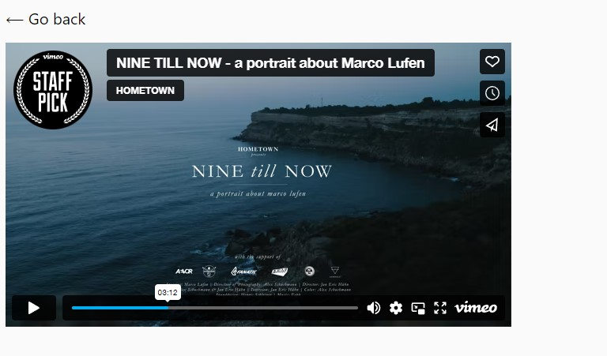
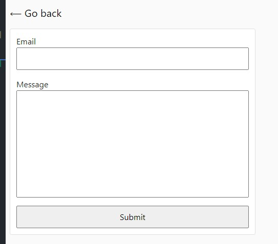

# This web application allows you to search for countries and get brief information about them.

## The project is based on Parcel.

## Task №1 Gallery

#### Added the SimpleLightbox library as a project dependency using npm. And Refactored to take into account that the library was installed via npm (import/export syntax). To connect the CSS code of the library to the project, one more import has been added, besides the one described in the documentation.

```// Described in the documentation
import SimpleLightbox from "simplelightbox";
// Additional style imports
import "simplelightbox/dist/simple-lightbox.min.css";
```


## Task №2 Vimeo player

#### The HTML has an <iframe> with a video for the Vimeo player. Write a script that will save the current video playback time to local storage and, when page reload, and continue playing the video from now on.

```
<iframe
  id="vimeo-player"
  src="https://player.vimeo.com/video/236203659"
  width="640"
  height="360"
  frameborder="0"
  allowfullscreen
  allow="autoplay; encrypted-media"
></iframe>
```

#### 1. Added Vimeo player library as project dependency via npm.

#### 2. The player is initialized in the script file as described in the pre-existing section player.

#### 3. Track the event timeupdate - updating the playback time.

#### 4. Save playback time to local storage.

#### 5. When reloading the page, the setCurrentTime() method was used to resume playback from the saved position.

#### 6. Added lodash.throttle library to the project so that the playback time updated in the repository no more than once per second.



## Task №3 Feedback form

#### 1. A script has been written that saves field values ​​to local storage when the user is typing something.

#### 2. Track the input event on the form, and each time write to the local storage object with email and message fields in which to save the current form field values.

#### 3. When the page is loaded, the state of the storage is checked, and if there is saved data, I fill the form fields with them. Otherwise, the fields must be empty.

#### 4. When submitting the form, I clear the storage and form fields and also display the object with fields email, message, and their current values ​​to the console.

#### 5. The storage is updated no more than once every 500 milliseconds. For this, the lodash.throttle library is used.


